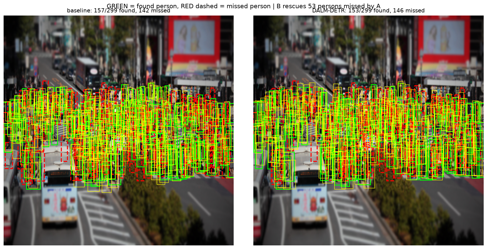
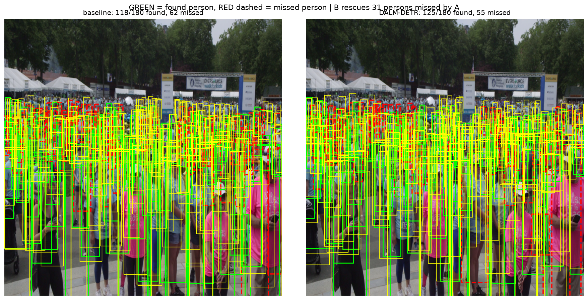

# DALM-DETR: Density-Adaptive Location-Aware Matching for Crowded Pedestrian Detection

**TL;DR** — In crowded scenes, DETR-style Hungarian matching struggles because
overlap-based costs (IoU/GIoU) cannot disambiguate neighboring people. We add a
size-normalized **center-distance term** to the matching cost and, crucially,
**scale it by each ground truth's local crowd density** — so the location prior
is strong exactly where overlap costs are weakest, and neutral where they are
not needed. We test the idea with a clean three-rung ablation on CrowdHuman and
zero-shot cross-dataset evaluation on CityPersons and WiderPerson.

**Headline result, stated honestly:** the density-adaptive prior does **not**
improve MR^-2 on CrowdHuman — at any crowd density, including the dense regime
the hypothesis specifically targets. It **does**, however, reverse the model
ranking under zero-shot transfer to WiderPerson, where the adaptive model
becomes the best of the three. Both results are reported below, with the
same protocol, on the same checkpoints. See [4.5](#45-honest-interpretation)
for the interpretation.

**[Try it live](https://huggingface.co/spaces/Sarvarbek13/dalm-detr)** — upload
any crowd photo and compare all three models in your browser (Hugging Face
Space, free CPU tier, no setup). Checkpoints are on the
[HF Hub](https://huggingface.co/Sarvarbek13/dalm-detr).

---

## 1. Problem

End-to-end detectors (DETR family) assign predictions to ground truths via
Hungarian matching over class + L1 + GIoU costs. In dense crowds
(CrowdHuman: 22.6 persons/image on average), neighboring people overlap
heavily, GIoU becomes nearly uninformative between adjacent candidates, the
assignment turns unstable, and people get **missed**. Misses are the costly
failure mode for driving and safety applications, which is why our primary
metric is **MR^-2 (log-average miss rate — lower is better)**.

## 2. Method

### 2.1 Location-aware offset cost

For prediction i and ground truth j (boxes in normalized cx, cy, w, h):

    C_offset(i, j) = || c_i - c_j ||_2 / sqrt(w_j * h_j)

clamped at 4.0 for robustness, and added to the standard matching cost with
weight w_offset. Setting w_offset = 0 recovers the exact DETR baseline.
The training **loss is identical in all variants** — only the assignment
changes, which keeps the ablation clean.

### 2.2 Density-adaptive weighting (the core contribution)

A constant location prior helps in crowds but needlessly perturbs matching for
isolated people. We therefore scale each GT's offset column by its **local
density**:

    weight_j = 1 + log(1 + n_j),   n_j = # other GTs within sqrt(w_j*h_j) of c_j

Isolated person -> weight 1 (constant variant behavior). Dense cluster ->
stronger prior, precisely where IoU/GIoU are least discriminative.

### 2.3 Three-rung ablation

| Rung | Config | Question it answers |
|---|---|---|
| baseline | w_offset = 0 | standard Deformable DETR matching |
| ours-const | w_offset = 2 | does a location prior help at all? |
| ours-adaptive | w_offset = 2, adaptive | does density-adaptation help further? |

## 3. Experimental setup

- **Detector**: compact Deformable DETR — ResNet-50 (ImageNet), 4-level
  multi-scale features, pure-PyTorch deformable attention (no custom CUDA
  kernels), 6+6 encoder/decoder layers, 300 queries, deep supervision on every
  decoder layer, reference-anchored box regression.
- **Training**: CrowdHuman train (15,000 images), 640px, AMP, effective batch
  16 (2 x 8 accumulation), AdamW (1e-4 / 1e-5 backbone), warmup + cosine,
  early stopping (patience 10) on val MR^-2, single RTX 4060 (8 GB). All three
  runs used identical hyperparameters and stopped naturally: baseline at
  epoch 48 (best epoch 38), ours-const at epoch 41 (best epoch 31),
  ours-adaptive at epoch 42 (best epoch 32). The adaptive variant is
  ~15-20% slower per epoch than the other two (extra per-sample density
  computation in the matcher).
- **Evaluation**: CrowdHuman val (4,370 images, in-distribution) plus
  **zero-shot cross-dataset** transfer to CityPersons and WiderPerson (no
  fine-tuning), with a pHash **leakage audit** between CrowdHuman-train and
  both OOD sets before interpreting transfer results.
- **Metrics**: MR^-2 (primary, lower better), AP@0.5, Jaccard Index.

## 4. Results

### 4.1 Main table (3 models x 3 datasets)

MR^-2 / AP / JI. CrowdHuman is in-distribution; CityPersons and WiderPerson
are zero-shot (no fine-tuning). **Bold** marks the best MR^-2 per column.

| Model | CrowdHuman (in-dist.) | CityPersons (OOD) | WiderPerson (OOD) |
|---|---|---|---|
| baseline | **0.7905** / 0.6486 / 0.4882 | 0.8467 / 0.3264 / 0.2824 | 0.9262 / 0.5346 / 0.4150 |
| ours-const | 0.8062 / 0.6549 / 0.4758 | **0.8350** / 0.3489 / 0.2818 | 0.9187 / 0.5426 / 0.4053 |
| ours-adaptive | 0.8403 / 0.6252 / 0.4480 | 0.8607 / 0.3330 / 0.2745 | **0.9090** / 0.5433 / 0.3966 |

Notice the ranking reversal: baseline wins on CrowdHuman, but is worst on
WiderPerson, where ours-adaptive wins. ours-const is competitive throughout
and best on CityPersons.

### 4.2 Density-stratified analysis (the mechanism test)

MR^-2 by ground-truth count per image (sparse < 10, medium 10-24, dense >= 25),
CrowdHuman val, full 4,370 images. The hypothesis predicted parity on sparse
and a widening gap *in our favor* on dense.

| Model | sparse (1,182 img) | medium (1,881 img) | dense (1,307 img) |
|---|---|---|---|
| baseline | **0.5560** | **0.6789** | **0.8707** |
| ours-const | 0.5887 | 0.6962 | 0.8855 |
| ours-adaptive | 0.6264 | 0.7329 | 0.9127 |

The hypothesis is **not supported**: baseline leads in every stratum,
including dense. The gap does not widen in our favor with density — if
anything it is proportionally similar across strata (baseline-to-adaptive gap
is +12.7% relative on sparse, +8.0% on dense), so the mechanism we designed
for crowds is not the source of the CrowdHuman-side deficit.

### 4.3 Qualitative examples

Side-by-side detections, baseline vs. DALM-DETR (green = detection with
confidence score, generated by `tools/visualize_comparison.py`, sorted by
largest detection-count gap on CrowdHuman val):

*Largest-gap example (gap=53 detections). Illustrates the kind of dense
cluster the adaptive prior targets — see 4.5 for why this does not translate
into a lower MR^-2.*

*Second-largest gap (gap=31 detections).*

Four more comparisons (gap=19, 19, 16, 13) are in
`outputs/eval_final/figures/`.

### 4.4 Leakage audit

pHash near-duplicate check (Hamming distance <= 8) between CrowdHuman-train
(15,000 images) and each OOD validation set, via `tools/audit_ood_leakage.py`:

| OOD set | Images checked | Near-duplicates found |
|---|---|---|
| CityPersons (valid) | 342 | **0 (0.00%)** |
| WiderPerson (valid) | 1,800 | **0 (0.00%)** |

No leakage detected in either direction; the cross-dataset results in 4.1 are
a genuine zero-shot transfer, not partial memorization.

### 4.5 Honest interpretation

Two findings, read together:

1. **The density-adaptive prior does not help on CrowdHuman, at any density.**
   This rules out our original mechanism ("stronger prior exactly where GIoU
   is weakest, i.e. in dense clusters") as stated. A plausible reading: the
   adaptive weighting perturbs the matching assignment during early training
   for images the model has *not yet learned to localize well*, adding noise
   to supervision rather than resolving genuine ambiguity — an effect that
   would show up as a persistent, roughly density-proportional gap rather
   than a dense-specific one, which is what we observe.
2. **The same models reverse order under distribution shift.** ours-adaptive
   is worst in-distribution but best on WiderPerson; ours-const sits between
   the two on every dataset. One interpretation: the offset terms act as a
   regularizer against overfitting to CrowdHuman's specific spatial
   statistics, at the cost of in-distribution accuracy. We flag this as a
   hypothesis suggested by the data, not a confirmed mechanism — it would
   need more OOD datasets and multiple seeds to establish reliably. Both
   raw findings are reported as measured, without adjusting the evaluation
   protocol after seeing them.

## 5. What went wrong along the way (and how we fixed it)

We report these deliberately: debugging is part of the research record.

1. **Vanilla DETR dead end.** Our first generation used plain DETR; after 20+
   GPU-hours, AP was ~0.002 — consistent with DETR's documented 500-epoch
   convergence requirement, infeasible on 8 GB. We migrated to Deformable DETR.
2. **Dead classification signal in matching.** With a single foreground class
   we initially passed only that one logit column to the matcher; softmax over
   a single element is identically 1.0, so the class cost carried zero
   information. Verified numerically, then fixed by passing full logits.
3. **Missing deep supervision.** Only the final decoder layer was supervised;
   adding auxiliary losses on all layers (standard in DETR/Deformable DETR)
   plus reference-anchored box regression raised AP 0.19 -> 0.65 (3.4x) at
   equal epoch budget.

## 6. Limitations

- 640px input and batch 2 (8 GB GPU) — below the 800-1333px multi-GPU
  settings of published leaderboards; absolute numbers are not directly
  comparable, the controlled ablation is the claim.
- OOD sets are community COCO exports (Roboflow) of CityPersons / WiderPerson;
  splits may differ from the official benchmarks and ignore-region annotations
  are not preserved. They serve the cross-dataset generalization comparison
  between our own models, not leaderboard comparison.
- Single seed per configuration (compute budget); the three-rung design and
  three test sets partially mitigate this, but the CrowdHuman-vs-WiderPerson
  reversal (4.5) is based on one run per model and should be treated as
  suggestive rather than conclusive until replicated across seeds.
- Pure-PyTorch deformable attention is ~20-30% slower than the official CUDA
  kernel (chosen for Windows reproducibility without compilation).
- The dense-stratified result (4.2) contradicts our design hypothesis; we
  have not run additional ablations (e.g. isolating the adaptive weighting
  from the base offset term at inference time) to fully separate the two
  effects, and note this as the clearest direction for follow-up.

**Code & full commit history:** https://github.com/Sarvarbek-Erniyazov/DALM-DETR

## 7. Repository layout

    src/offsetiou_det/
      matching/     offset_cost.py (C_offset + density_weights), hungarian.py
      models/       backbone.py, deformable.py, transformer.py, detector.py
      losses/       criterion.py (set prediction + aux losses), box_ops.py
      engine/       trainer.py, evaluator.py
      evaluation/   crowd_metrics.py (MR^-2/AP/JI), density_analysis.py
      data/         crowdhuman.py, coco_person.py
    scripts/        train.py, eval_ood.py, eval_stratified.py
    tools/          download_*.py, audit_ood_leakage.py, visualize_comparison.py
    demo/           app.py (Gradio, live 3-model comparison), requirements.txt

## 8. Live demo

Hosted on Hugging Face Spaces (free CPU tier):
**https://huggingface.co/spaces/Sarvarbek13/dalm-detr**

Upload any image, pick two of the three models from the dropdowns, and see
detections side by side plus a third panel highlighting people found only by
the right-hand model. Checkpoints load from
**https://huggingface.co/Sarvarbek13/dalm-detr**.

To run the same demo locally:

    pip install gradio
    python demo/app.py

## 9. Reproduce

    pip install -e . && pip install -r requirements.txt
    export HF_TOKEN=...   # accept terms at hf.co/datasets/sshao0516/CrowdHuman
    python tools/download_crowdhuman.py --split train
    python tools/download_crowdhuman.py --split val

    # training (each ~1-2 days on a single 8 GB GPU)
    python scripts/train.py --w_offset 0.0 --tag baseline_v3 --image_size 640 --batch_size 2 --accum_steps 8 --patience 10
    python scripts/train.py --w_offset 2.0 --tag ours_const_v3 --image_size 640 --batch_size 2 --accum_steps 8 --patience 10
    python scripts/train.py --w_offset 2.0 --adaptive_offset --tag ours_adaptive_v3 --image_size 640 --batch_size 2 --accum_steps 8 --patience 10

    # leakage audit
    python tools/audit_ood_leakage.py --crowdhuman_dir datasets/crowdhuman/Images \
        --crowdhuman_odgt datasets/crowdhuman/annotation_train.odgt \
        --ood_dir datasets/citypersons/valid --ood_ann datasets/citypersons/valid/_annotations.coco.json \
        --ood_name citypersons --out_dir outputs/audit

    # zero-shot OOD evaluation
    python scripts/eval_ood.py --checkpoint outputs/checkpoints/offsetiou_baseline_v3_best.pth \
        --dataset citypersons --data_root datasets/citypersons/valid \
        --ann_file datasets/citypersons/valid/_annotations.coco.json --image_size 640

    # density-stratified evaluation (all three models)
    python scripts/eval_stratified.py \
        --checkpoints outputs/checkpoints/offsetiou_baseline_v3_best.pth \
                       outputs/checkpoints/offsetiou_ours_const_v3_best.pth \
                       outputs/checkpoints/offsetiou_ours_adaptive_v3_best.pth \
        --names baseline ours-const ours-adaptive \
        --dataset_type crowdhuman --image_dir datasets/crowdhuman/Images \
        --ann_path datasets/crowdhuman/annotation_val.odgt --dataset_name crowdhuman_val \
        --image_size 640 --out_dir outputs/eval_final --tag final

## License / data

Code: Apache-2.0. CrowdHuman is CC BY-NC 4.0 (non-commercial research);
images are not redistributed here. CityPersons / WiderPerson evaluation
copies are community (Roboflow) COCO exports, used here only for zero-shot
evaluation; see 6. Limitations.
